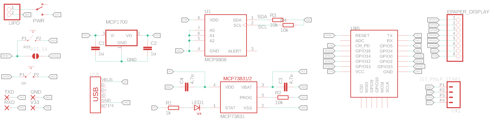

# IoT ePaper Display

The IoT ePaper Display should be able to show different messages from smart home devices or temperature measurements. The main part is the 2,9" ePaper Display, which fits directly onto the self designed PCB. The PCB contains an ESP8266, a linear voltage regulator, a LiPo charger circuit and a temperature sensor on the bottom of the board. Furthermore it offers an optional I2C jack to connect some other sensors or devices.

It will use the deep sleep functionality of the microcontroller to reduce power consumption and to elongate battery lifetime.

I just have started this project so it is currently a work in progress and will be updated frequently.

## Requirements

- PCB
- 2.9" ePaper Display
- ESP8266-12F
- MCP1700 3.3V LDO
- MCP9808 temperature sensor
- MCP73831 LiPo charger
- SMD power switch
- micro usb jack
- 2x 3x6mm SMD button
- JST-PH-2 2mm 90° SMD connector
- JST-PH-4 2mm 90° SMD connector
- LiPo battery

## Schematics and PCB

I have compress the schematics in the image so that everything is visible (hopefully it is). The EAGLE-files are in this repository as well.

This is the first version of the pcb. Till now it is just a draft cause I have not test it yet.

